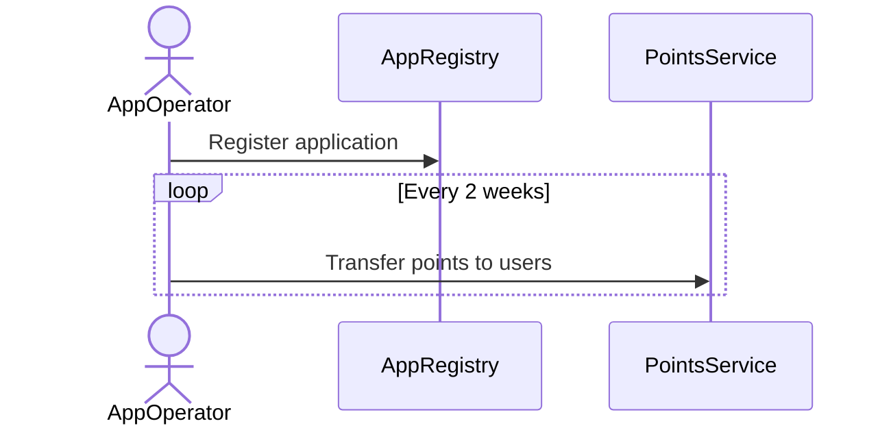

# B3 Points SDK



# Installation

```
yarn add @b3dotfun/b3-points.sdk
```

```
npm install @b3dotfun/b3-points.sdk
```

# Getting Started

Intialize the library for AppRegistry.
```typescript
import {AppRegistry} from '@b3dotfun/b3-points.sdk';
import { B3PointIndexerURLOnB3Sepolia, B3SepoliaAppRegistryContractAddress} from '@b3dotfun/b3-points.sdk'
import { b3Sepolia } from 'viem/chains'
import 'viem/window'

const registry = new AppRegistry(
  B3SepoliaPointIndexerURL,
  B3SepoliaAppRegistryContractAddress,
  b3Sepolia,
);

```

Intialize the library for B3PointService (BPS).
```typescript
import {BPS} from '@b3dotfun/b3-points.sdk';
import { B3PointIndexerURLOnB3Sepolia, B3SepoliaPointServiceContractAddress} from '@b3dotfun/b3-points.sdk'
import { b3Sepolia } from 'viem/chains'
import 'viem/window'

 const bps = new BPS(
   B3SepoliaPointIndexerURL,
  B3SepoliaPointServiceContractAddress, 
  b3Sepolia,
);
```
## Connecting RPC provider
Connecting the provider is only required for the write operations that interact with
the contract. For listing and other read operations interact with the indexer, and thus
connecting to rpc provider is not required.
```
registry.connect(window.ethereum); // for browser only. For Script registry.connect() to use defaull provider
```


## Setting Up Account
Contract write call requires wallet account which can be initiated in two ways.
#### JSON-RPC Account
A JSON-RPC Account is an Account whose signing keys are stored on the external Wallet
A JSON-RPC Account can just be initialized as an Address string. 
In the usage below, we are extracting the address from a Browser
Extension Wallet (e.g. MetaMask) with the window.ethereum 
Provider via eth_requestAccounts

```typescript
import 'viem/window'

const [account] = await window.ethereum.request({
method: 'eth_requestAccounts'
})
```

#### Local Accounts (Private Key, Mnemonic, etc)
A Local Account is an Account whose signing keys are stored on 
the consuming user's machine. It performs signing of 
transactions & messages with a private key before broadcasting
the transaction or message over JSON-RPC.


```typescript
import { privateKeyToAccount } from 'viem/accounts'

const account = privateKeyToAccount('0x...')
```

## Register an app

The `register` function allows you to register an application to the AppRegistry. This function returns the app ID.

### Example

```typescript
// Init AppRegistry
// Connect RPC
// Init Account

const appName = 'game.b3.fun';
const operator = '0xFD50b031E778fAb33DfD2Fc3Ca66a1EeF0652165';

const appId = registry.register({
  appName: appName,
  operator: operator,
  account 
});
```

## List Apps
The `listApps` function returns all the registered apps. It accepts `rankings` and pagination arguments.
You can filter apps by `operator` and `ensName`

### Example

```typescript
// Init AppRegistry

const response = await registry.listApps({
  rankings: { direction: "DESC", attribute: "createdAt" },
  pageNumber: 1,
  pageSize: 10,
});
```

## Grant Points (only B3 admin)

The `grantPoints` function allows B3 admin to grant points to 
qualified applications for the upcoming session. This is only callable by B3 Admin.

### Example

```typescript
// Init BPS
// Connect RPC
// Init Account

bps.grantPoints({
  requests: [
    {appId: 2n, point: 10000},
    {appId: 3n, point: 40000},
    {appId: 4n, point: 80000},
    ...
  ]},
  account: account,
);
```

## Transfer Points

The `transferPoints` function allows app operator to distribute granted points to users only for the current ongoing session. Once finalized (the session is advanced), the points cannot be updated anymore.

### Example

```typescript
// Init BPS
// Connect RPC
// Init Account

const appId = 2n; // app ID for 'game.b3.fun'

const transferUIDs = bps.transferPoints({
  appId,
  requests: [
    {recipient: '', point: 325},
    {recipient: '', point: 920},
    {recipient: '', point: 21},
    ...
  ]},
  account: account
);
```

## Cancel Transfer (optional)

The app operator can optionally call `cancelTransfer` to cancel a pending transfer (that is in the current session) if needed to undo a transfer.

### Example

```typescript
// Init BPS
// Connect RPC
// Init Account

bps.cancelTransfer({
    uid: '0xb16fa048b0d597f5a821747eba64efa4762ee5143e9a80600d0005386edfc995'
  },
  account: account,
);
```

## Advance Session
Advance Session creates a new session

### Example

```typescript
// Init BPS
// Connect RPC
// Init Account

await bps.advanceSession(
  account,
);
```

## Get App Total Points
Returns the total point by the appId. Optionally you can provide session
to get total points for the app for that session only.

### Example

```typescript
// Init BPS

const response = await bps.getAppTotalPoints({
  appId: 3n,
  session: 1n,
});
```
## Get App Available Points
Returns the total point by the appId after distributing it to the user. Optionally you can provide session
to get total points for the app for that session only.

### Example

```typescript
// Init BPS

await bps.getAppAvailablePoints({
  appId: 3n,
  session: 1n,
});
```

## Aggregate App Points
Returns a list of total points grouped by the appId. Optionally you can provide session
to get total points for each app for that session only.
You can also provide rankings and pagination arguments.

### Example

```typescript
// Init BPS

const response = await bps.aggregateAppPoints({
  session: 1n,
  rankings: { direction: "ASC", attribute: "points" },
  pageNumber: 1,
  pageSize: 10,
});
```

## Get User Total Points
Returns the points of a user. Provide session to get total points for a session.
### Example

```typescript
// Init BPS

await bps.getUserTotalPoints({
  account: "0x....",
});
```
## Aggregate User Points
Returns a list of total points grouped by the user address. Optionally you can provide session
to get total points for each user for that session only.
You can also provide rankings and pagination arguments.

### Example

```typescript
// Init BPS

const response = await bps.aggregateUserPoints({
  appId: 3n,
  session: 1n,
  rankings: { direction: "DESC", attribute: "points" },
  pageNumber: 1,
  pageSize: 10,
});
```

## Examples
For full examples of each operation follow `src/example` folder