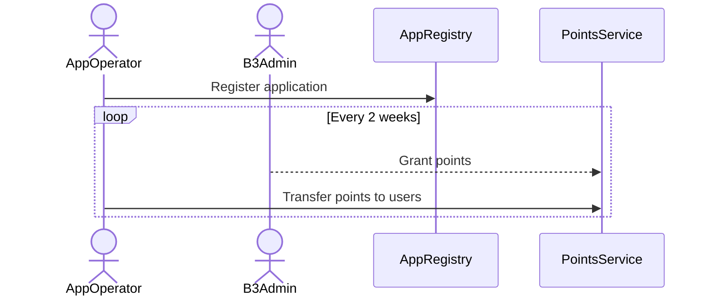

# B3 Points SDK



# Installation

```
yarn add @b3-fum/bps-sdk
```

```
npm install @b3-fum/bps-sdk
```

# Getting Started

Intialize the library for AppRegistry.
```typescript
import {AppRegistry} from '@b3-fun/bps-sdk';
import {ethers} from 'ethers';

const APP_REGISTRY_ADDRESS = "0xaddr";
const appRegistry = new AppRegistry(APP_REGISTRY_ADDRESS);

const provider = ethers.getDefaultProvider('b3-sepolia');
appRegistry.connect(provider);
```

Intialize the library for B3PointService (BPS).
```typescript
import {BPS} from '@b3-fun/bps-sdk';
import {ethers} from 'ethers';

const BPS_ADDRESS = "0xaddr";
const bps = new BPS(BPS_ADDRESS);

const provider = ethers.getDefaultProvider('b3-sepolia');
bps.connect(provider);
```

## Register an app

The `register` function allows you to register an application to the AppRegistry. This function returns the app ID.

### Example

```typescript
import {getGatewayResponse} from './utils';

// initialize appRegistry
// ...

const appName = 'game.b3.fun';
const operator = '0xFD50b031E778fAb33DfD2Fc3Ca66a1EeF0652165';
const gatewayResponse = getGatewayResponse(name); // call ENS offchain registry.

const appId = appRegistry.register({
  appName: appName,
  operator: operator,
  gatewayResponse: gatewayResponse
});
```

## Grant Points (only B3 admin)

The `grantPoints` function allows B3 admin to grant points to qualified applications for the upcoming session. This is only callable by B3 Admin.

### Example

```typescript
// initialize BPS
// ...

const signer = new ethers.Wallet(privateKey, provider); // B3 admin

bps.grantPoints({
  requests: [
    {appId: 2, point: 10000},
    {appId: 3, point: 40000},
    {appId: 4, point: 80000},
    ...
  ]},
  signer: signer
);
```

## Transfer Points

The `transferPoints` function allows app operator to distribute granted points to users only for the current ongoing session. Once finalized (the session is advanced), the points cannot be updated anymore.

### Example

```typescript
// initialize BPS
// ...

const signer = new ethers.Wallet(privateKey, provider); // app operator

const appId = 2; // app ID for 'game.b3.fun'

const transferUIDs = bps.transferPoints({
  appId,
  requests: [
    {recipient: '', point: 325},
    {recipient: '', point: 920},
    {recipient: '', point: 21},
    ...
  ]},
  signer: signer
);
```

## Cancel Transfer (optional)

The app operator can optionally call `cancelTransfer` to cancel a pending transfer (that is in the current session) if needed to undo a transfer.

### Example

```typescript
// initialize BPS
// ...

const signer = new ethers.Wallet(privateKey, provider); // app operator

bps.cancelTransfer({
    uid: '0xb16fa048b0d597f5a821747eba64efa4762ee5143e9a80600d0005386edfc995'
  },
  signer: signer
);
```

## Get App Total Point

Call contract to get the total point granted to an application for a given session.

## Get App Available Point

Call contract to get the point left after distributing points to users for a given session.

## Get User Point

Call graphQL api to get the total point for a user. This should allow filters for sessions and apps.